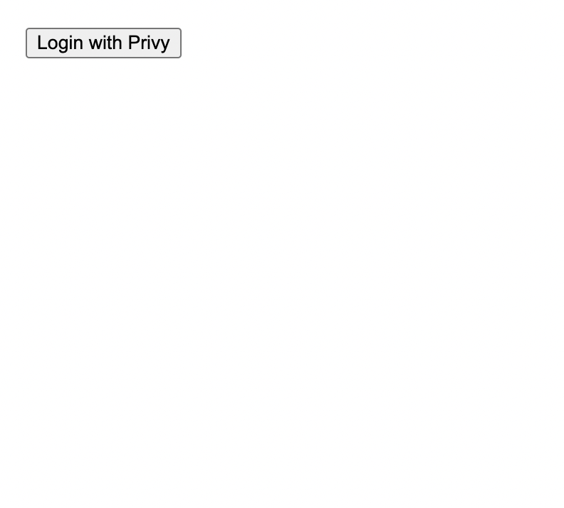
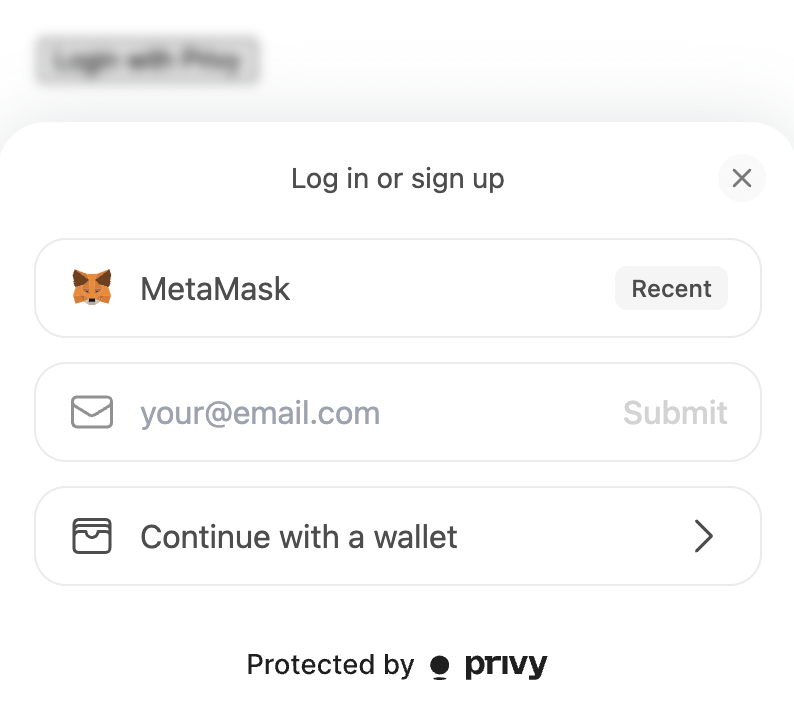
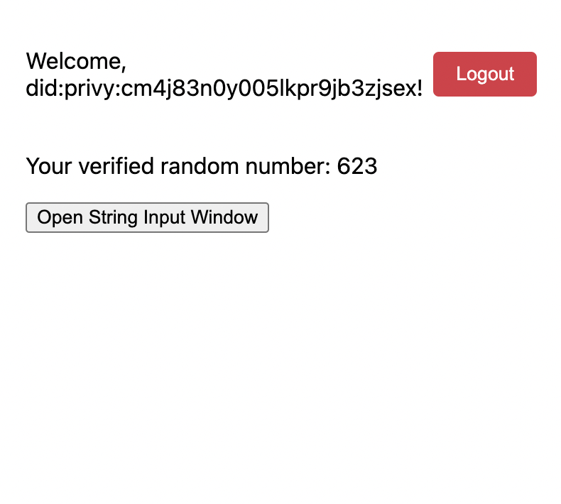
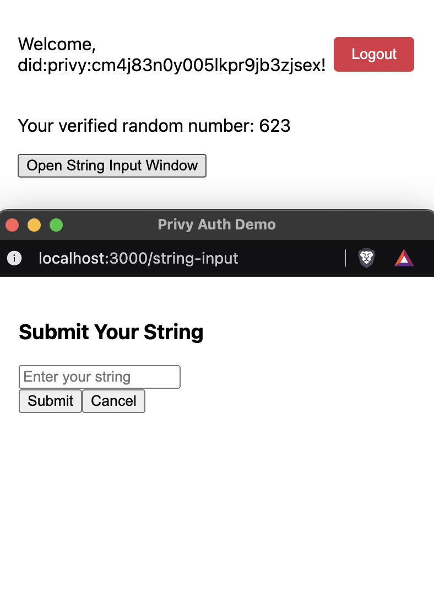
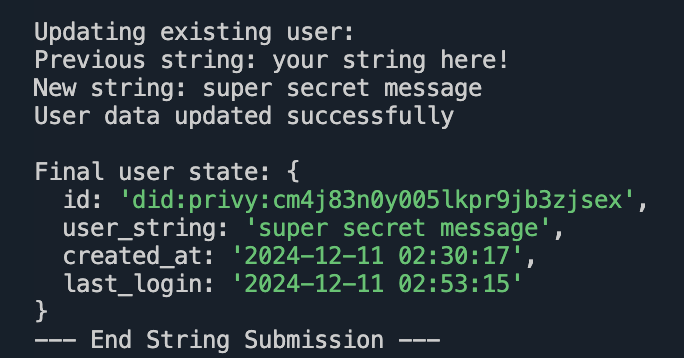

# Privy Authentication Implementation Guide

This document explains how to implement Privy authentication in a full-stack JavaScript application, including JWT verification and protected API endpoints.

## Overview

The implementation consists of three main parts:
1. Client-side authentication with Privy
2. Server-side JWT verification
3. Protected API endpoints

## Setup

### Prerequisites
- Privy account and API credentials
- Node.js and npm
- SQLite for data storage

### Environment Variables

Copy the .env.example file to .env and fill in the values.

### Database

This example uses SQLite for simplicity. This can be replaced in production with MongoDB,

### Starting up the server

1. Run `npm install` to install the dependencies.
2. Run `npm run build` to build the site.
3. Run `node server.js` to start the server.

### Testing the server

1. Run `npm run dev` to start the development server.
2. Navigate to `http://localhost:3000` in your browser.
3. Click the "Login" button to authenticate with Privy.
4. Once authenticated, you should see a random number and your user ID.
5. Click the "Open String Input Window" and enter a value.
6. Verify in the DB (or in the server logs) that the value was stored.

## Example Flow with Screenshots

### 1. Initial Login Screen

*User arrives at the application and sees the login button*

### 2. Wallet Selection

*User selects MetaMask as their authentication method*

### 3. Post-Authentication View

*After successful authentication, user sees their random number and user ID*

### 4. String Input Window

*User enters a string value in the popup window*

### 5. Server Processing

*Server logs showing successful string submission and processing*

